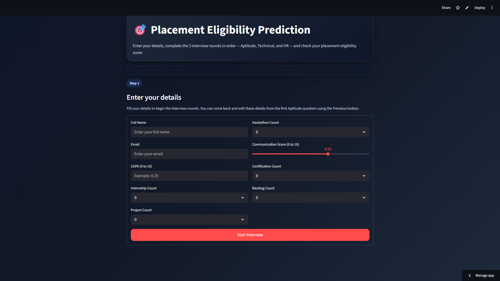

# Placement Eligibility Prediction System

An AI-powered placement readiness assessment platform designed to evaluate a student's placement eligibility based on academic performance, technical skills, internships, projects, certifications, communication ability, and assessment scores.

The system provides placement probability predictions, assessment-based analytics, and insights that help students understand their readiness for recruitment processes.

---

## Dashboard Preview




## Demo Video

🎥 Watch the Project Demo:

**YouTube Demo:** https://youtu.be/GzlSxwHtVCQ?si=ehLyYebNwjD3Lj0g

> The demo video showcases the complete workflow, including student data input, assessments, prediction generation, and analytics.


## Key Features

### Placement Eligibility Prediction

Predicts placement readiness using machine learning techniques and student performance indicators.

### Aptitude Assessment

Evaluates quantitative, logical reasoning, and aptitude-related skills.

### Technical Assessment

Measures technical knowledge and problem-solving capabilities.

### HR Assessment

Analyzes communication, confidence, and professional readiness.

### Placement Probability Scoring

Generates an overall placement eligibility score and prediction probability.

### Student Analytics Dashboard

Provides visual insights and performance summaries.

### User-Friendly Interface

Interactive Streamlit-based dashboard for easy usage.

---

## Technology Stack

| Category                | Technologies              |
| ----------------------- | ------------------------- |
| Programming Language    | Python                    |
| Frontend                | Streamlit                 |
| Machine Learning        | Scikit-Learn              |
| Data Processing         | Pandas, NumPy             |
| Model                   | Logistic Regression       |
| Development Environment | Jupyter Notebook, VS Code |
| Version Control         | Git & GitHub              |

---

## Project Workflow

```text
Student Information
        │
        ▼
Assessment Scores
(Aptitude + Technical + HR)
        │
        ▼
Data Processing
        │
        ▼
Machine Learning Model
        │
        ▼
Placement Probability Prediction
        │
        ▼
Analytics & Recommendations
```

---

## How It Works

### Step 1: Enter Student Details

The user provides:

* Academic information
* Skills
* Internship experience
* Project experience
* Certification details
* Communication score
* Backlog information

### Step 2: Complete Assessments

The platform evaluates the user through:

* Aptitude Questions
* Technical Questions
* HR Questions

### Step 3: Data Processing

The collected information is preprocessed and transformed into a format suitable for machine learning prediction.

### Step 4: Prediction Generation

The trained Logistic Regression model calculates the placement eligibility probability.

### Step 5: Result Analysis

The system displays:

* Placement Probability
* Eligibility Status
* Assessment Scores
* Performance Insights

---

## Installation

### Clone Repository

```bash
git clone https://github.com/GovindSharma0629/placement_pred.git
cd placement_pred
```

### Create Virtual Environment

```bash
python -m venv venv
```

### Activate Environment

Windows:

```bash
venv\Scripts\activate
```

Linux/macOS:

```bash
source venv/bin/activate
```

### Install Dependencies

```bash
pip install -r requirements.txt
```

### Run Application

```bash
streamlit run app.py
```

---

## Repository Structure

```text
placement_pred/
│
├── assets/
│   └── dashboard.png
│
├── data/
├── models/
├── app.py
├── requirements.txt
├── README.md
└── notebooks/
```

---

## Future Improvements

* Resume Analysis Module
* AI-Powered Interview Preparation
* Skill Gap Analysis
* Personalized Learning Recommendations
* Resume ATS Score Checker
* Multi-Model Prediction Comparison
* Advanced Analytics Dashboard

---

## Learning Outcomes

This project helped strengthen practical knowledge in:

* Machine Learning
* Logistic Regression
* Data Preprocessing
* Feature Engineering
* Streamlit Development
* Model Evaluation
* Git & GitHub
* End-to-End ML Deployment

---

## Author

### Govind Sharma

Computer Engineer | AI/ML Developer | Python Developer

📍 Ahmedabad, Gujarat, India

### Connect With Me

**Portfolio:** https://govindsharma0.netlify.app/

**LinkedIn:** https://www.linkedin.com/in/govind-sharma-a2121a278/

**GitHub:** https://github.com/GovindSharma0629

---

> Building practical AI and machine learning solutions that solve real-world problems.
